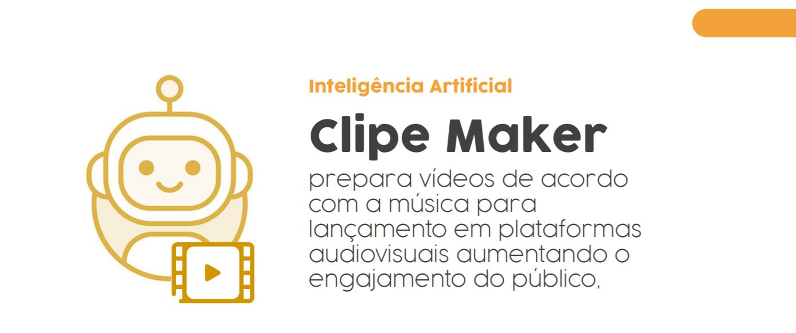

# 
Musikze

*
Sony Music code/stage
*

## 💡 Proposta
<i>A sua música em todo lugar e a tecnologia democratizando o acesso para revelar verdadeiros artistas. </i>
Um ranking multiplataforma e inteligente que utiliza inteligência artificial e machine learning para promover novos artistas, a partir das músicas mais ouvidas e utilizadas nas mídias sociais. Além disso colabora com a distribuição das músicas em diferentes canais e entrega vídeos para lançamento em plataformas audiovisuais.
  
### 🎶 Potencializando a música e a arte:
- Facilita o upload das músicas para várias plataformas
- Provê uma plataforma de gerenciamento simples e objetiva
- Auxilia na criação de vídeos para o lançamento em plataformas como Youtube e Vimeo

### 🤖 Inteligência Artificial
Usamos integrações de APIs e sistemas de *Natural Language Understand* para gerar de forma inteligente vídeos clipes que sejam atrativos e representem bem a ideia da música

### 🤝 Benefícios para todos
- <b>Artistas</b>
  - Reduz a burocracia e o retrabalho para upar suas músicas
  - Assim, o artista consegue focar no que mais gosta de fazer, criar!
- <b>Público</b>
  - Visualização dos artistas em sua plataforma preferida
  - Pode conhecer novos artistas que antes não conseguiam distribuir seus trabalhos
- <b><i>Produtores</i></b>
  - Gerenciamento de vários artistas de forma centralizada
  - Acompanhamento de ganhos e desempenhos para várias plataformas

## ⚙ Tecnologias

- [NodeJS](https://nodejs.org/)
- [React](https://reactjs.org/)
- 
### 🤖 IA
- [Algorithmia](https://algorithmia.com/)
- [IBM Watson](https://cloud.ibm.com/login)
- [Google Cloud Plataform](https://cloud.google.com/)

 ## 💪 Time
  - Daniel Leite (Designer)  [LinkedIn](https://www.linkedin.com/in/daniel-leite-aa17b843/) . [Behance](https://www.behance.net/danielrodrigo)
  - Léo Moraes (Business) [LinkedIn](https://www.linkedin.com/in/leohmoraes/)
  - Everton Ferreira (Dev) [LinkedIn](https://www.linkedin.com/in/evertonferreira96/)
  - Sávio Sucar (Marketing) [Linkedin](https://www.linkedin.com/in/diagosucar/)
  - Vinicius Passos (Dev) [LinkedIn](https://www.linkedin.com/in/vtpa/) . [GitHub](https://github.com/vtpa)